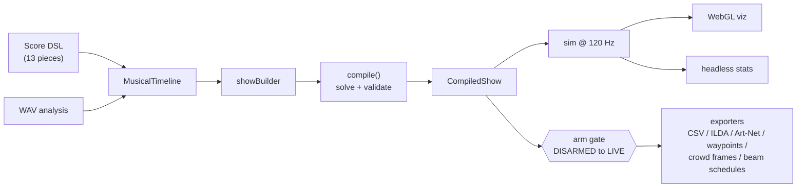
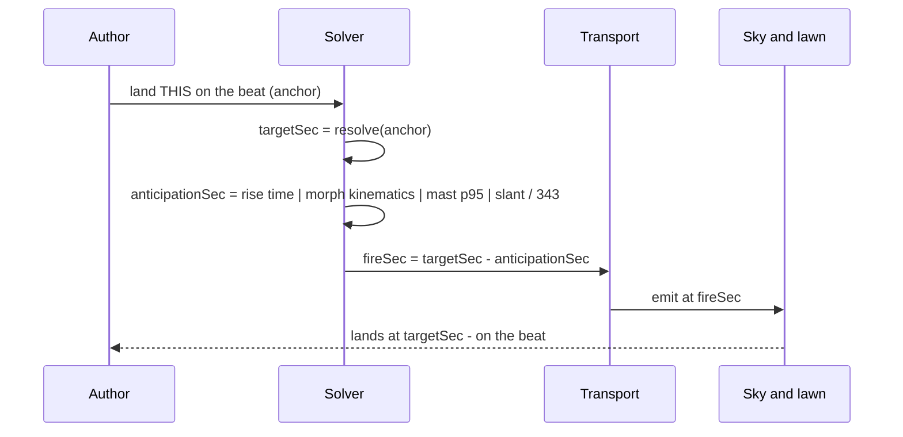

# Theodoor — Theatrical Pyrotechnics and Synchronized Visual Displays

Theodoor is a full suite for the conception, fabrication planning, and orchestration of
theatrical displays: LED panels, drone swarms, pyrotechnics, staged fabrications
(waterfalls, lancework, wheels), laser primitives, audience augmentation devices
(LED wristbands and phones as a "crowd canvas"), steerable directional-audio
beams, illuminated fountain banks whose columns crest on the beat, and moving-head
searchlights that carve the sky — nine media combined into a single
musically-synchronized show for maximum aesthetic effect. You author a show against
a musical timeline — a built-in score or an analyzed WAV — and Theodoor solves the
firing schedule, validates it against the site, a noise budget, and a
carrier-exposure budget, simulates every star, drone, crowd cell, beam, water
column, and light head deterministically, and emits the paperwork and control files
a crew would use — plus the printed program a guest would read.


*Night of the Spheres, act 2 — every dot sampled from the deterministic 120 Hz sim.
More in the [gallery](docs/gallery.md).*

> ## Safety & scope
>
> - **This is show-design and simulation software.** It designs, validates, simulates,
>   and documents displays; it does not operate hardware.
> - **Effects are opaque catalog metadata.** A catalog entry carries performance data
>   only — timing, geometry, colors, noise level. There is no energetic-materials
>   information anywhere in this codebase, and a repo-wide guard test keeps it that way.
> - **Simulation-first.** The only hardware-facing artifacts are file exports
>   (firing-script CSV, ILDA, Art-Net, drone waypoints, crowd-broadcast frames,
>   beam-steering schedules), and emitting them is gated behind an arm / e-stop
>   safety state machine with an explicit operator acknowledgement. Everything
>   else runs entirely in the simulator.
> - **Directional audio carries its own budget.** The beam medium is opaque
>   performance metadata like everything else, and a carrier-exposure ceiling
>   (instantaneous cap plus a rolling dwell rule at every audience cell) is
>   enforced by `compile()` whenever a show uses beams — always on, never opt-in.
> - **"Fabrication" means staging hardware.** The `fab` module produces mortar-rack and
>   panel-frame drawings (SVG) and bills of materials — mounting structure, never
>   devices.
> - **Water and light are fixtures.** Fountain banks and searchlight banks are DMX
>   fixtures like the panels and lasers — nozzle rows with pumps and underwater
>   lamps, moving heads with pan/tilt limits. Their catalog entries carry crest
>   heights, beam widths, colors, and slew rates; nothing else. Searchlights carry a
>   validated elevation floor so a beam can never be swept across the audience.
> - **Quiet shows are a first-class feature.** Every flagship program ships a quiet
>   variant for noise-sensitive audiences, enforced by validation, not convention.

## Quickstart

```sh
npm install
npm test        # ~1,600 deterministic tests
npm run build
npm run dev     # visualizer — pick a flagship program (try 'Vltava — the river'), choose a seat, press play
```

After `npm run build`, the CLI is available:

```sh
node packages/cli/dist/index.js align    --show july4                 # solve + diagnostics
node packages/cli/dist/index.js simulate --show nye --to 60 --json    # headless sim stats
node packages/cli/dist/index.js export   --show july4 --target cue-sheet --out out/
node packages/cli/dist/index.js export   --show cosmos --target program-notes --out out/   # the guest's printed program
node packages/cli/dist/index.js fab      --target bom
node packages/cli/dist/index.js analyze  --wav yourfile.wav
```

The hardware-facing export targets (`firing-script`, `artnet`, `waypoints`, `ilda`,
`crowd-broadcast`, `beam-steering`) require an explicit acknowledgement — without
`--armed-ack 'ARM CONFIRMED'` the CLI refuses and exits with code 4:

```sh
node packages/cli/dist/index.js export --show july4 --target firing-script --out out/ \
  --armed-ack 'ARM CONFIRMED'
```

## Architecture

| Package | What it is |
| --- | --- |
| [`packages/core`](packages/core) | The engine: music + WAV analysis, effect catalog, site model, safety machine, acoustics, choreography, transport, exporters, fab drawings, the show solver/builder, and the simulator. Pure isomorphic TypeScript, zero runtime dependencies. |
| [`packages/cli`](packages/cli) | Command-line front end: `align`, `simulate`, `export`, `fab`, `analyze` over the flagship programs. |
| [`packages/viz`](packages/viz) | WebGL + WebAudio visualizer (Vite app): renders live sim snapshots with bloom, star streaks, wind-drifted haze, water columns and sky beams, synthesizes the score, and auditions the show from a chosen seat — shell reports arriving after their true time-of-flight, beam-delivered thunder landing with the flash, fountains rushing up before the beat, all in one seeded lakeside reverb. |
| [`programs`](programs) | Flagship show programs — `july4`, `nye`, `hallows`, `cosmos`, `aurora`, `cardstunt`, and their quiet variants — plus shared [palettes](programs/src/palettes.ts). |



The keystone of the whole system is one identity, applied everywhere:
**`fireSec = targetSec − anticipationSec`**. You author *when things should be seen*
(a shell break on a downbeat, a drone formation fully formed by the chorus); the solver
works backward to when each cue must fire. Shells are fired early by their rise time so
the break lands on the beat; drone anticipation is not a constant at all but is solved
from fleet kinematics — launch grid, per-pad departure timelines, and trapezoidal-profile
morph transitions between formations. A crowd broadcast is commanded one p95 command
latency early so the wristband field completes its ramp **on** the beat, and a
directional-audio beam is fired one acoustic time-of-flight early (`distance / 343 m/s`)
so the sound **lands on the beat at the listener** — for the everywhere-at-once bell
strike, one ToF per cell. The two newest media add two more kinds of physics: a
fountain valve opens its latency plus the column's ballistic rise `√(2h/g)` early so
the water **crests** on the beat (a shell's rise time, in water), and a searchlight
bank is commanded its head **slew** early — angular distance from wherever the heads
were last aimed, over the bank's slew rate — so the light arrives on its figure on the
beat. Six media, six anticipations, one landing.




*One beat, four kinds of physics: rise time, morph kinematics, broadcast latency,
time-of-flight — all solved backward from the same landing.*


*Commanded one p95 early; ~95% of the field lands exactly on the beat.*

### Program notes — the show as a story

Every flagship carries `show.notes`: a tagline, music credits, and acts anchored to the
same musical marks the cues land on. `compile()` resolves them to seconds
(`compiled.acts`), the visualizer captions the current act, the timeline poster bands
by act, and `export --target program-notes` prints the guest's program — each act with
its note, an auto-generated "Look for" line computed from the cues inside it (how many
shells and how many carry beam-delivered thunder, the largest formation, the tallest
crest, which figures the searchlights draw), and a closing paragraph that explains the
keystone identity with the show's own extremes. It is a design artifact, ungated like the
cue sheet.

### Module map (`packages/core/src`)

- [`contracts.ts`](packages/core/src/contracts.ts) — frozen interchange types every module codes against.
- `math` — seeded deterministic RNG, per-cue seeds, vectors, colors, easing curves.
- `time` — tempo maps (beats ↔ seconds), meters, quantize grids.
- `text` — 5×7 bitmap font used by drone text/digit formations and panel tickers.
- `music` — notation DSL, thirteen built-in scores, `Score → MusicalTimeline`, bar-aligned score concatenation.
- `music/analysis` — WAV pipeline: decode → STFT → spectral-flux onsets + A-weighted energy → tempo estimate → annotated `MusicalTimeline`.
- `catalog` — validated effect registry (the `starter-v1` set) and cue-param validation.
- `site` — `SitePlan` validation rules (plus per-medium rule files for the fountain and searchlight banks), the derived audience crowd grid, and the `lakesidePark()` demo venue.
- `safety` — arm / go-live / stand-down / e-stop state machine, interlocks (site freshness, wind, operator ack, carrier exposure, broadcast bandwidth), audit log, gate tokens.
- `acoustics` — SPL propagation, summed listener timelines, quiet-budget reports with substitution hints, beam aim/footprint geometry, and the carrier-exposure report.
- `choreo` — formation generators, morph planning and drone assignment, pyro volleys/chases, crowd/beam cue factories, fountain nozzle geometry and searchlight figure geometry (the single owners of where the water and the light go), conflict checks (pins, pads, mast bandwidth, beam slew).
- `transport` — deterministic play/pause/seek transport, event bus, cue scheduler (no wall clock).
- `export` — pure byte/string builders: firing-script CSV, markdown cue sheet, ILDA laser files, Art-Net DMX (panels, lasers, fountain nozzles, searchlight heads), drone waypoints, crowd-broadcast frames, beam-steering schedules, and the guest-facing program notes.
- `fab` — staging-hardware parametrics: mortar-rack and panel-frame drawings (SVG) and BOM rollups.
- `show` — anchors, the two-phase alignment solver, validation, `compile()` (which also resolves the program-note acts to seconds), the fluent `showBuilder` with its per-medium facades, and the analysis-driven show generator.
- `sim` — fixed-timestep 120 Hz engine: shell ascent and closed-form stars (with velocities, for streaks), drone fleet flight, laser/panel frames, the crowd canvas (seeded latency ramps), beam steering states, ballistic water columns, searchlight head chains, SPL, headless stats.
- `gallery` — deterministic SVG/SMIL builders behind every image in this README and the docs gallery.

## Crowd & beam — the audience as instrument

Two media turn the audience itself into part of the display:

- **`crowd`** — LED wristbands and phones addressed as a cell grid derived over the
  audience zone (the "crowd canvas"): color floods, waves, radial pulses, section
  chases, sparkles, card-stunt text, heartbeats, phone-flashlight starfields, and
  wristband haptics. Broadcast latency is the anticipation: the solver commands each
  pattern one p95 command latency early, and the simulator scatters per-device arrival
  through the mast's seeded latency distribution, so the field visibly ramps in and
  completes exactly on the musical moment. Mast bandwidth (concurrent mask updates per
  second) is a solver-enforced constraint like rack pin capacity.
- **`beam`** — steerable directional-audio arrays whose sound is audible essentially
  only inside a cone footprint on the lawn: localized whispers, flyovers that sweep the
  crowd, crossed stereo pairs that image *from a place* (a hovering drone formation can
  hum from where it hangs), pings, zone pulses, and the everywhere-at-once bell strike
  (`cells: 'all'` — one time-of-flight per cell). Acoustic time-of-flight is the
  anticipation, which enables the signature *thunder-with-flash* trick: a shell's
  report, beam-delivered, lands **with** its light instead of half a second behind it.
  Beams flow through the same SPL pipeline as every other medium (in-footprint level,
  −20 dB leakage outside) and carry an always-enforced carrier-exposure budget.

In the visualizer, pick a seat ("sit:" control) to audition the beams spatially —
per-beam delay is the true time-of-flight and crossed pairs image through genuinely
different arrival times — and watch the crowd band beneath the stage light up cell by
cell. A second HUD meter tracks worst-cell carrier exposure against the budget.

## Water & light — fixtures with kinematics

The two newest media are lighting-desk fixtures with real physics in their timing:

- **`fountain`** — illuminated nozzle rows on the water behind the firing line
  (`fount-west` / `fount-east` on the demo venue: nine nozzles over 32 m, shooters to
  45 m). Programs: plumes and 45 m shooters, peacock fans that lean outward along the
  row, running cascades that crest nozzle by nozzle on the beat grid, rolling waves,
  and a low mist screen. The anticipation is honest ballistics — the bank's valve
  latency plus `√(2h/g)` — so a column commanded for a downbeat **crests** on it and
  falls dry exactly at the end of its visible window. Water is quiet (60–72 dB at
  15 m), so every fountain entry is legal in quiet variants; a `fountain-height` rule
  refuses crests above the bank's pump ceiling and a `fountain-drift` rule warns when
  wind would carry spray toward the front row.
- **`searchlight`** — moving-head sky beams at the ends of the line (`lights-west` /
  `lights-east`: four heads each, 60°/s slew, 75° max tilt, a 20° elevation floor
  toward the audience). Figures: pillars, a converging spire that meets over center
  stage, fans, slow sweeps, crossed pairs, and beat chases. The anticipation is the
  **slew**: the solver chains each bank's figures and fires a cue early by the largest
  head's angular distance from the previous figure's end aim (or park, straight up)
  over the slew rate — the light is visibly in motion and arrives on the beat. The sim
  and the DMX exporter walk the same chain, and a squeezed slew surfaces as a
  `sim/light-slew-short` warning rather than a silent correction.


*The 45 m shooter: 0.15 s of valve latency plus 3.03 s of rise, solved so the crest lands
on the beat.*


*Slew as anticipation: the second figure departs the first figure's aim, not park.*

Both media export over Art-Net alongside the panels and lasers — four channels per
nozzle (level, r, g, b) and six per head (pan, tilt, dimmer, r, g, b) — behind the
same arm / go-live gate as every other hardware target.

## The visualizer — seeing and hearing the physics

`npm run dev` opens the WebGL visualizer over any flagship program. What it draws is the
120 Hz sim snapshot, nothing more — but it now draws it well: an offscreen bloom pass
gives stars, columns, and beams their glare; fast stars trail streaks from the sim's own
closed-form velocities; every burst leaves a faint puff of haze that drifts downwind at
the site's wind speed and dissolves; fountain columns rise as lit water with a highlight
that brightens at the crest; searchlights sweep as scattering sky beams that add up where
they converge. The strip below shows all nine lanes with hatched anticipation lead-ins,
and the current act's title and program note fade in at each act boundary.

Pick a seat ("sit:") and the audition follows you. The score is synthesized; every beam
is heard through its footprint and true arrival delay; and now every shell reports —
born at its burst, arriving `slant / 343 m/s` later, propagated at −6 dB per doubling and
dulled by air absorption with distance, panned by bearing. From Front-Center a peony's
boom lands about two-thirds of a second after its flash, exactly the lag the cosmos
program calls "old physics" — and the beam-tagged shell next to it lands with the light.
Mines whoosh at the racks, comets sigh upward, set pieces hiss, fountains rush up before
the beat and crest on it; a flyover's aim crossing the lawn bends its pitch like a moving
source; the whole lawn sits in one seeded reverb with a treeline slapback 0.35 s behind
you, under a soft limiter. Deterministic, like everything else: same seed, same sound.


*`lakesidePark()`: the demo venue every flagship compiles against, with the six
beam arrays' horizon-bounded throw arcs.*


*Carrier-exposure report for The Unquiet Hour — enforced by `compile()`, never
opt-in.*

## Programs

Twelve flagship programs are built on the [`showBuilder`](packages/core/src/show/builder.ts)
authoring surface:

- **`july4`** — a suite of *The Stars and Stripes Forever* joined bar-aligned to the
  *1812 Overture* finale (`concatScores`), with flag formations, cannon-hit volleys,
  crowd waves through the trio, and a climax barrage.
- **`nye`** — *Auld Lang Syne* with a drone countdown to midnight, crowd pulses
  shadowing every digit, a whispered count-in, and a "2027" crowd marquee.
- **`hallows`** — *The Unquiet Hour*: Danse Macabre, In the Hall of the Mountain King,
  and an original dawn coda. The haunting arrives through sound before anything is
  seen — twelve everywhere-at-once bell strikes, roving whispers, invisible flyovers
  that become bats, a ghost that moans from where it hovers, and a heartbeat that
  infects the crowd cell by cell until every wrist pounds on the beat.
- **`cosmos`** — *Night of the Spheres*: Also sprach Zarathustra, The Blue Danube, and
  Jupiter's hymn. Time-of-flight is the theme: the show lets you hear a shell's report
  lag its flash ("old physics"), then repairs it — every burst's thunder beam-delivered
  to land with its light, while a comet formation crosses the sky trailing its own sound.
- **`aurora`** — *Midsummer Aurora*: Gymnopédie, Clair de Lune, and the Moonlight
  adagio. Quiet-first: the entire first act is painted on the audience alone, the sky
  joins at moonrise, and the show ends in silence — a single cell blinking once where
  the aurora was born. The quiet variant is byte-identical: enforcement-only proof of
  quiet-native design.
- **`cardstunt`** — *The Living Field*: three passes of Ode to Joy as a crowd-canvas
  tech demo — calibration figures, card-stunt images, and a crowd digit countdown
  racing the drone countdown off the same landings array. The program implementers copy.
- **`vltava`** — *Vltava — The River*: Smetana's tone poem, scene by scene, as the
  showcase for water and light. Two springs crest on the first two beats of the night
  (a cold blue-white plume, a warm gold one); the river runs as outward cascades in 6/8
  under a drone surface; the forest hunt fans gold searchlights through the trees while
  horn calls bounce between the front corners; the wedding polka stomps in crowd
  sections, low mines, and peacock fans; at moonlight the searchlights converge into a
  spire that hangs as the moon while a single 45 m shooter crests on each nymph chime;
  the rapids churn — crossed violet beams, fast cascades, thunder-tagged crossettes, a
  roar sweeping the lawn; the broad river lands everything on one beat — triple gold
  brocade with its thunder, nine 45 m shooters on both banks, white pillars, a gold
  bloom; and Vyšehrad closes with the spire as the castle, the fleet spelling VLTAVA,
  and one last plume fading as the river flows on.
- **`*-quiet`** — every show ships a quiet variant for noise-sensitive audiences.


*The broad river: shells, thunder, water, light, drones, and wristbands, six
anticipations solved backward to one landing.*


*One landing, six kinds of physics — every lead solved, none authored.*


*The Unquiet Hour, all nine lanes; the hatching before each cue body is its
anticipation. The [gallery](docs/gallery.md) has the river program's moonlight scene
and nine-lane timeline, the NYE quiet-budget chart, the formation atlas, and more.*

What makes a quiet variant quiet is enforcement, not taste. A show with
`variant: 'quiet'` **rejects at validation** any catalog effect louder than 100 dB at
the 15 m reference distance — salutes and large peonies are illegal to author, so quiet
shows lean on low-noise comets, crossettes, and mines plus drones, lasers, and panels.
On top of that ceiling, `.noiseBudget(85)` enforces a summed-SPL budget at the audience
listener positions, with automatic substitution of individually-over-budget cues.

## Music

Both music sources produce the exact same `MusicalTimeline`, so everything downstream —
solver, generators, visualizer — is agnostic about where the beat grid came from:

- **Authored scores.** Fourteen public-domain pieces ship in the notation DSL —
  Ode to Joy, The Stars and Stripes Forever, the 1812 Overture finale, Auld Lang Syne,
  Danse Macabre, In the Hall of the Mountain King, an original dawn coda, the
  Zarathustra sunrise, The Blue Danube, Jupiter's hymn (Thaxted), Gymnopédie No. 1,
  Clair de Lune (9/8, notated on the eighth), the Moonlight adagio (triplet grid), and
  Smetana's Vltava — 152 bars through eight scenes with meter and tempo changes
  (`getScore(id)` / `SCORES`). Scores carry tempo maps, voices, and annotations (beats,
  downbeats, phrase ends, labelled hits, climaxes) that cues anchor to.
- **WAV analysis.** `analyzeWav` runs the onset/tempo/energy pipeline over your own
  audio and emits the same timeline shape, so `generateShowFromAnalysis` can build a
  show for music that was never notated.

## Determinism & testing

Everything is deterministic: no wall clock and no ambient randomness anywhere in the
engine (a repo guard test enforces it). Randomness is seeded per cue from the show seed,
the transport and simulator compute step times by multiplication rather than
accumulation, and exporters are golden-byte tested — the same show compiles to the same
bytes, every run, on every machine. The suite is ~1,600 vitest tests under
[`packages/core/test`](packages/core/test) (plus CLI, viz, and program suites),
including repo-wide safety-vocabulary and end-to-end determinism guards, a
crest-timing cross-check for every fountain cue, and a slew-arrival cross-check
for every searchlight chain. Every image in this README is generated by the engine
and regenerates byte-identically:

```sh
npm test
npm run gallery        # rewrite docs/gallery/*.svg from the engine
npm run gallery:check  # fail if the committed assets drifted from the code
```
