# Theodoor gallery

Every image on this page (and in the README) is **generated deterministically by the
engine itself** — no hand-drawn art. `npm run gallery` rebuilds the CLI, loads the
flagship programs, samples the 120 Hz simulator, and rewrites `docs/gallery/*.svg`
byte-identically; `npm run gallery:check` fails if the committed assets have drifted
from the code. Animated files are plain SMIL SVG, so they loop right here on GitHub.

## Scenes

### The Unquiet Hour at the summit — one sim snapshot

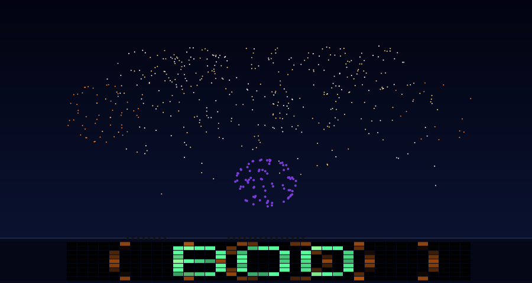

A single `SimSnapshot` at the show's strength-1.0 climax: the brightest 450 barrage
stars, the drone fleet, and the crowd canvas — same seed, same image, every run.

### Night of the Spheres — act 2 orbit loop


A 16-second window sampled at 4 fps: the 140-drone orrery, pad-2's comet crossing
with its chasing beam tag, a thunder-tagged waltz shell (closed-form burst rosette),
and the crowd band waving in 3/4.

### Vltava — the broad river


Sixteen seconds around the strength-1 climax of *Vltava — The River*: the rapids
barrage resolves into three gold brocades (each with beam-delivered thunder), nine
45 m shooters crest on both banks, white pillars stand at the ends of the line, the
fleet blooms gold, and the crowd floods — all landing on one beat.

### Vltava — moonlight

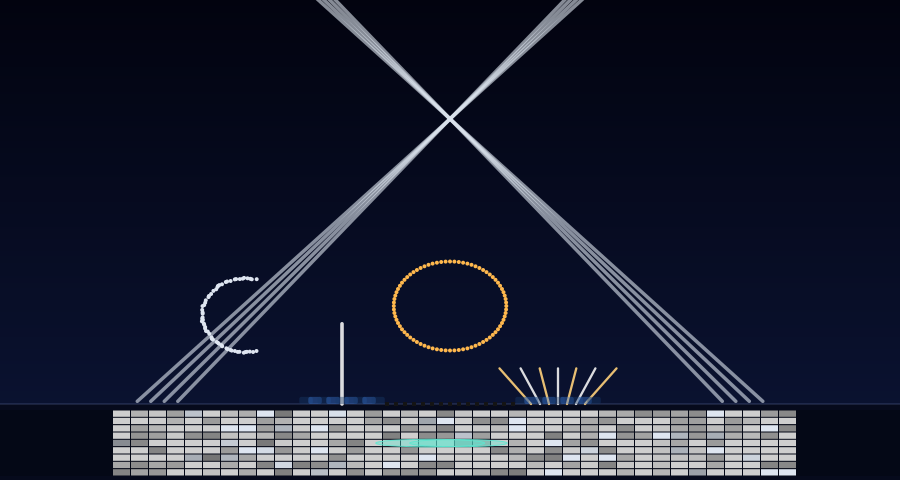

Half a second after the 'moonlight' accent: the two banks' heads have slewed into a
spire that hangs as the moon, the crescent holds over pad-2, and the first nymph
shooter is at its 45 m crest — commanded 3.18 s early so the water, not the light,
is what lands on the chime.

## The keystone

Everything in Theodoor pivots on one identity: `fireSec = targetSec − anticipationSec`.
You author when something should **land**; the solver works backward to when it must
**fire**.

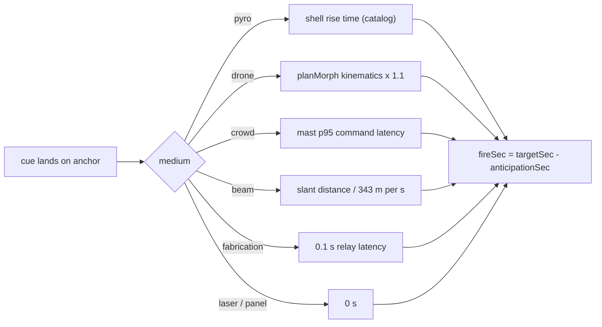

### One landing, six kinds of physics

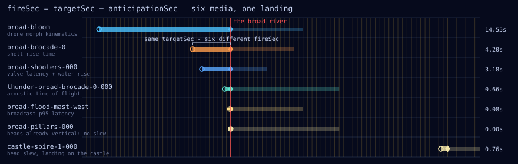

The river program's climax from real solver output: the gold bloom's 14.5 s morph,
the brocades' 4.2 s rise, the shooters' 3.18 s of valve latency plus water rise, the
thunder tags' 0.66 s of sound flight, the wristband flood's 0.08 s broadcast lead —
one `targetSec`, five different `fireSec`; the pillars need no slew (their heads are
already vertical), and the castle spire that follows shows the slew lead landing on
the Vyšehrad chorale.

### One beat, four kinds of physics

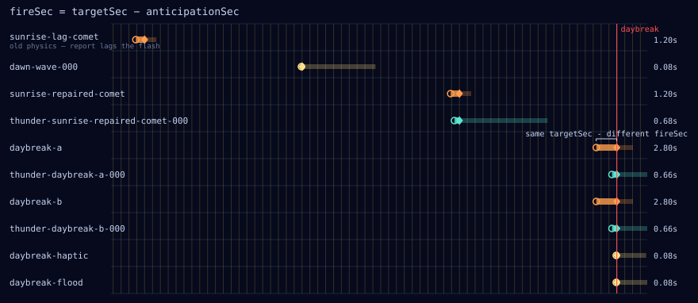

The cosmos "physics repaired" excerpt from real solver output: the lone lag comet
whose report arrives late, then the daybreak cluster — peonies (2.8 s rise), their
beam-delivered thunder (0.66 s of sound flight), a wristband haptic and flood
(0.08 s broadcast lead) — all sharing one `targetSec` with four different `fireSec`.

### The crowd ramp, made visible


The phone starfield's per-cell arrival delays come from the same seeded latency
model the simulator ramps with: commanded one p95 early, ~95% of the field lands
exactly on the beat tick.

## The solver

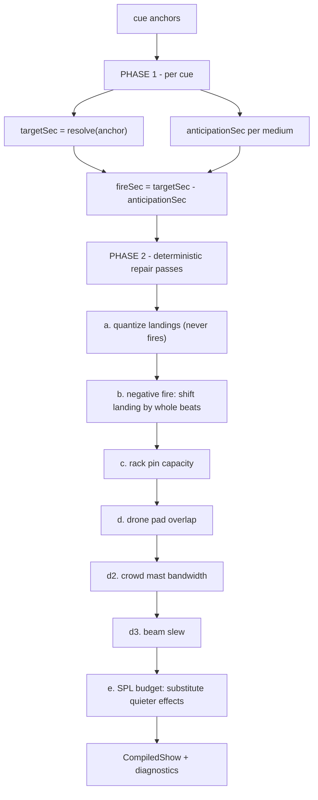

## Water & light

The two newest media are lighting-desk fixtures with real kinematics in their timing.

### The column crests on the beat

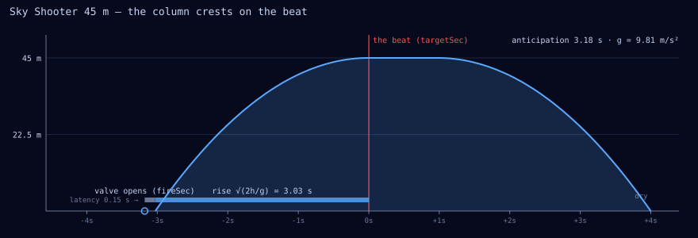

The 45 m shooter charted from the fountain sim's own closed form: the valve opens at
`fireSec`, water appears after the bank's 0.15 s latency, the column rises on
`h = v₀τ − gτ²/2` and crests exactly on the beat — an anticipation of
`0.15 + √(2·45/9.81) = 3.18 s`, the shell's rise time in water. It holds through the
cue's window and falls dry at the end of it.

### Slew as anticipation

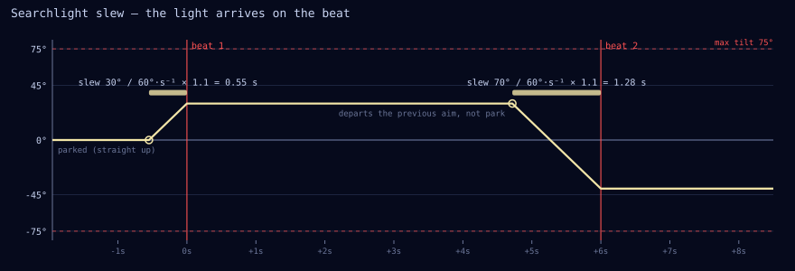

A searchlight bank's heads are chained like a drone pad's formations: the first figure
slews from park (straight up) and arrives on beat one; the second departs the first
figure's *end aim*, not park, and arrives on beat two. Each lead is the largest head's
angular distance over the bank's slew rate, with the same 1.1× margin the sim chain
uses — a squeezed slew surfaces as a `sim/light-slew-short` warning, never a silent
correction.

## Site & geometry

### The flagship venue

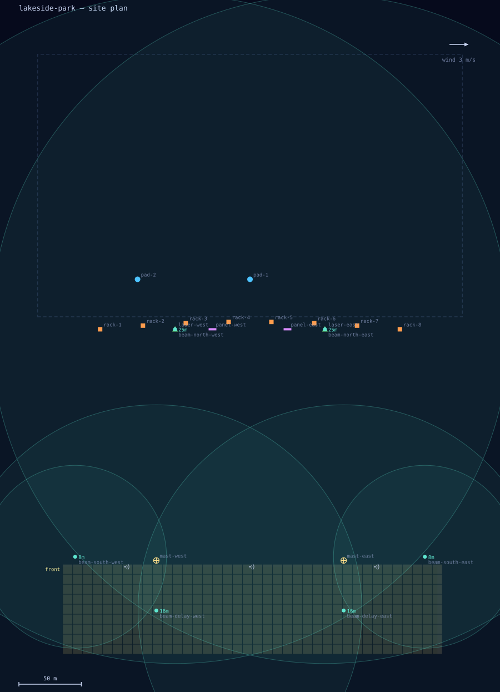

`lakesidePark()`: the 8-rack arc, two drone pads, laser towers, LED panels, two
crowd masts, six directional-audio arrays with their horizon-bounded throw arcs
(25 m north masts ≈ 267 m, 16 m in-lawn delay towers ≈ 165 m, 8 m corner masts
≈ 73 m), two nine-nozzle fountain banks on the water behind the racks, and two
four-head searchlight banks at the ends of the line. Every flagship compiles against
this plan.

### Footprint geometry

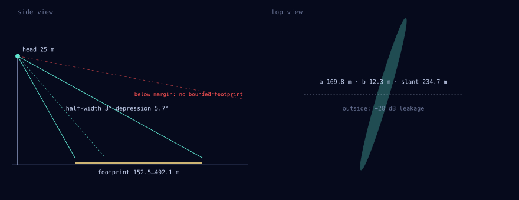

A beam's audible region is its cone's intersection with the ear-height plane — an
ellipse spanning `h/tan(ε+α) … h/tan(ε−α)` downrange. Aims whose depression comes
within 2° of the half-angle have no bounded footprint and fail validation.

### Beam flyover

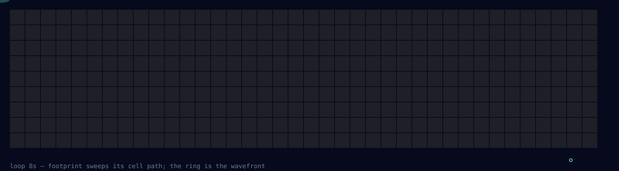

A hallows act-1 "invisible flyover": the footprint sweeps its cell path while the
wavefront ring expands from the array head — sound moving through a crowd with
nothing in the sky.

## Programs

### The Unquiet Hour — full-show timeline

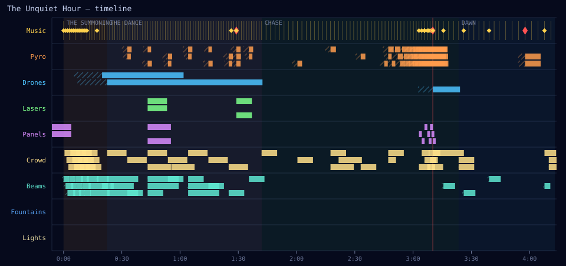

All nine lanes over ~4.3 minutes (the fountain and searchlight lanes stay dark — the
haunting has no use for water or light until dawn). The hatching before each cue body is its
anticipation — the twelve everywhere-at-once bell strikes carry visibly long
time-of-flight leads on the Beams lane.

### Vltava — all nine lanes

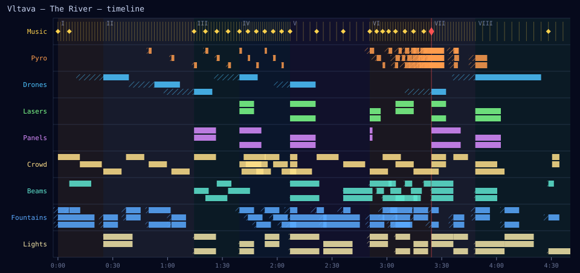

Every lane carries cues: the fountain lane's long hatched lead-ins are valve latency
plus ballistic rise; the searchlight lane's short ones are solved head slews. Act
bands come from the program notes.

### Fleet kinematics

The cosmos liftoff chain: launch grid → spiral galaxy → orrery. Drone anticipation
is never a constant — it is solved per transition from trapezoidal-profile
kinematics over exactly these point pairings.

### Formation atlas

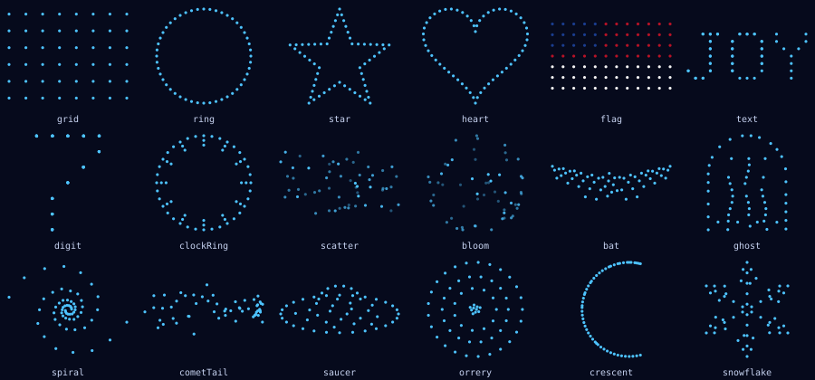

## Acoustics & budgets

### Carrier exposure — always enforced

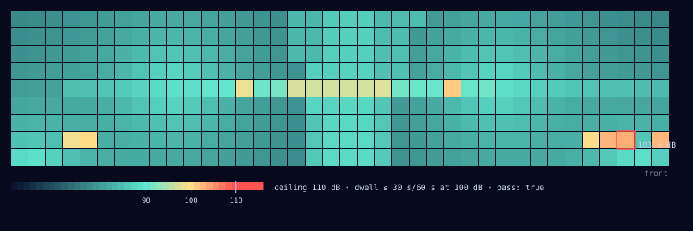

`compile()` runs the exposure report whenever a show uses beams — an instantaneous
110 dB ceiling plus a rolling dwell rule at every audience cell. Never opt-in.

### The quiet budget

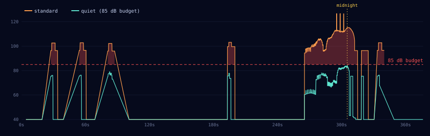

New Year's Eve, standard vs quiet at the center listener: the quiet variant's
summed SPL never crosses the 85 dB budget the validator enforces.

## Safety

The only hardware-facing artifacts are file exports, and emitting them walks a
strict state machine with five interlocks (site freshness, wind, operator ack,
carrier exposure, broadcast bandwidth) and a hash-chained audit log:

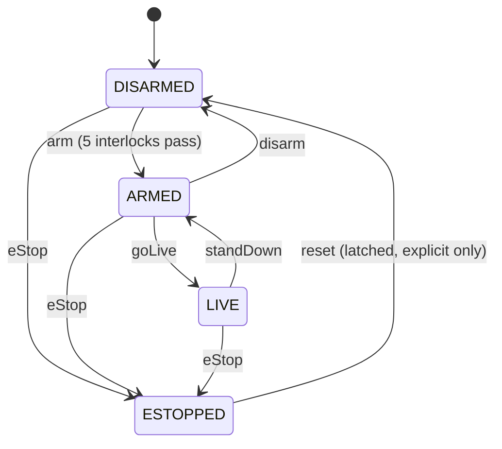

## Fabrication

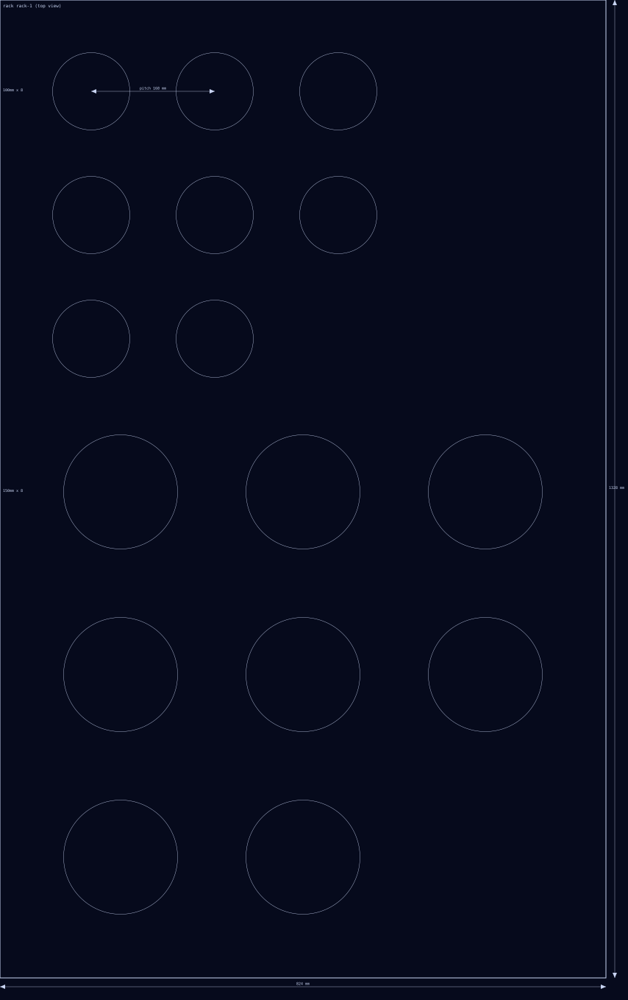

The `fab` module's staging-hardware output — the same deterministic SVG the
`theodoor fab` command writes, restyled for the gallery page.
